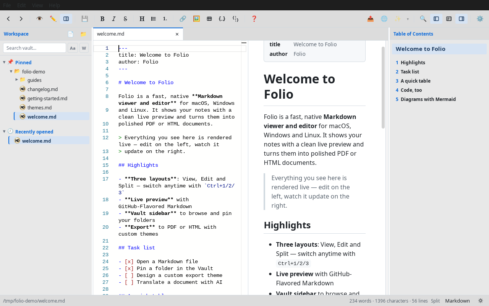
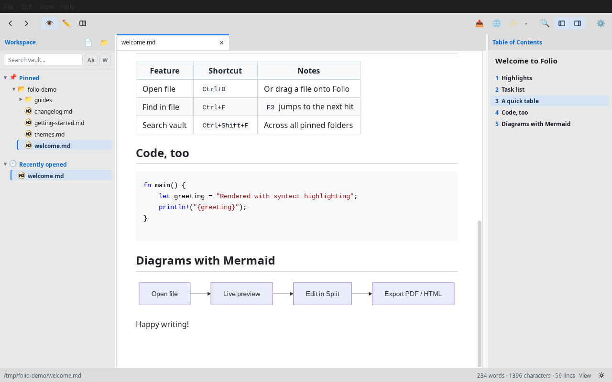
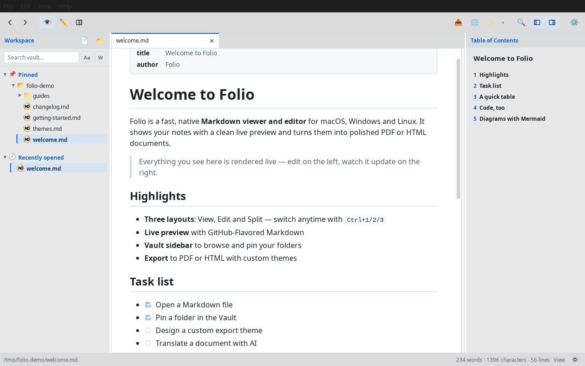
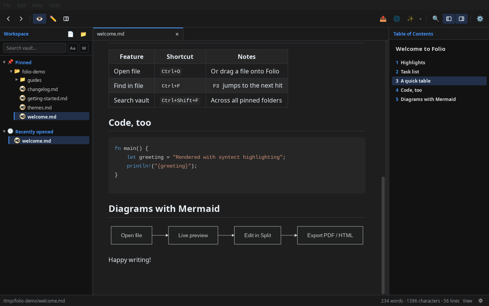

# Folio

A fast, good-looking Markdown viewer and editor for macOS, Windows and Linux.

Folio opens your `.md` files with a clean live preview, lets you edit them in a
proper code editor, and turns them into polished PDF or HTML documents. It also
handles plain text, code, HTML and images, so it works well as an everyday
"open this file and show it to me nicely" app — not just for Markdown.

Built with [Tauri 2](https://tauri.app/), so it's a small native app rather
than a browser in disguise.



---

## Download

Grab the installer for your platform from the
[**Releases page**](https://github.com/ralfkuh-lab/folio/releases):

| Platform | File |
|---|---|
| **macOS** | `Folio_<version>_x64.dmg` |
| **Windows** | `Folio_<version>_x64-setup.exe` (or `.msi`) |
| **Linux** — Debian / Ubuntu | `Folio_<version>_amd64.deb` |
| **Linux** — Fedora / openSUSE | `Folio-<version>-1.x86_64.rpm` |
| **Linux** — any distro (portable) | `Folio_<version>_amd64.AppImage` |

### First launch: a security prompt you can safely dismiss

Folio isn't signed with a paid Apple/Microsoft certificate, so on first launch
your OS shows a scary-looking warning. This is expected — here's how to get past
it once:

- **macOS** — right-click `Folio.app` → **Open** → confirm **Open** in the
  dialog. If it still refuses ("Folio is damaged"), run once in Terminal:

  ```bash
  xattr -d com.apple.quarantine /Applications/Folio.app
  ```

- **Windows** — on the SmartScreen screen, click **More info** → **Run anyway**.

You only have to do this the first time.

---

## What you can do with it

**Read comfortably**
- Live GitHub-Flavored Markdown preview: task lists, tables, footnotes, frontmatter
- Mermaid diagrams rendered right in the page
- Light and dark theme, plus a whole set of **view themes** you can switch between
- A document outline (table of contents) you can click to jump around
- Full-text search inside a single file, or across your whole workspace

**Edit properly**
- Three layouts you switch anytime: **View**, **Edit**, and **Split** (editor +
  live preview side by side)
- A real editor under the hood (Monaco, the one from VS Code) with syntax
  highlighting, minimap and multi-level undo
- A formatting toolbar for bold, italic, headings, lists, links and tables —
  with a built-in cheat sheet if you forget the Markdown syntax
- Paste an image straight from the clipboard and Folio saves it next to your
  document and inserts the link for you

**Keep your files organized**
- A **Vault** sidebar: browse folders, pin the ones you use most (drag to
  reorder), and jump back to recent files
- Open several files at once in **tabs** — reorder them by dragging, and Folio
  remembers them for next time
- Files ignored by `.gitignore` are dimmed so your working tree stays readable

**Export something you can share**
- Export to **PDF** or **HTML** with an optional cover page, headers/footers and
  proper code syntax highlighting
- Pick from built-in export layouts, or design your own theme in the in-app
  **theme editor** with live preview
- Share themes as `.mdtheme` files, or let the built-in **AI theme author**
  design one for you

**Let AI help (optional)**
- **Translate** a document into one or more languages — your code blocks are
  protected so they come back untouched
- **AI actions**: summarize, reformat, proofread, extract action items, build
  tables — with an editable prompt and a diff review so you always see the
  changes before they're applied
- Bring your own provider and API key; keys are stored separately and never
  leave your machine except to call your chosen provider

**Handle more than Markdown**
- Code and text files open read-only with syntax highlighting
- HTML files render in a sandboxed preview
- Images (PNG, JPG, GIF, WebP, SVG, BMP, ICO, AVIF) are shown scaled to fit

## Screenshots

Rendered Markdown with GFM tables, syntax-highlighted code and Mermaid diagrams:



Light and dark theme:

<table>
  <tr>
    <td></td>
    <td></td>
  </tr>
</table>

---

## Getting started

1. **Open a file** — drag a file onto the window, or use **File → Open** (Ctrl/Cmd+O).
2. **Switch how you look at it** — Ctrl/Cmd+**1** for View, **2** for Edit,
   **3** for Split.
3. **Pin a folder** — open a folder in the Vault sidebar on the left and pin it
   so it's always one click away.
4. **Export** — **File → Export…** to turn the current document into a PDF or
   HTML file.

On Linux you can also register Folio's icon for `.md` files in your file
manager (no `sudo` needed):

```bash
scripts/install-folio-icons.sh
```

## Keyboard shortcuts

On macOS use **Cmd** instead of **Ctrl**.

| Shortcut | Action |
|---|---|
| Ctrl+O | Open a file |
| Ctrl+S / Ctrl+Shift+S | Save / Save As |
| Ctrl+W | Close current tab |
| Ctrl+Q | Quit |
| Ctrl+1 / Ctrl+2 / Ctrl+3 | View / Edit / Split mode |
| Ctrl+Tab / Ctrl+Shift+Tab | Next / previous tab |
| Ctrl+Z / Ctrl+Shift+Z | Undo / Redo |
| Ctrl+F / F3 | Find in document / find next |
| Ctrl+Shift+F | Search the whole vault |
| Ctrl+V | Paste an image into the document |

## Languages

Folio follows your system language automatically and ships in **nine
languages**: English, German, Spanish, French, Portuguese (Brazil), Italian,
Russian, Simplified Chinese and Japanese. To pin one instead, go to
**Settings → General → Language** — the change applies on the next launch.

---

## For developers

Folio is a Tauri 2 app: a Rust backend (`src-tauri/src/`) with a TypeScript
frontend (`src-tauri/web/`) using the Monaco editor. Markdown is rendered by
[comrak](https://github.com/kivikakk/comrak); the shipped frontend bundles live
in `src-tauri/dist/` and are checked in.

### Build from source

Prerequisites: [Rust](https://rustup.rs/) 1.80+, the Tauri CLI
(`cargo install tauri-cli`), and on Linux `libwebkit2gtk-4.1-dev`.
[Node.js](https://nodejs.org/) 18+ is only needed if you change the frontend.

```bash
cd src-tauri
cargo run                      # build + launch a debug build
cargo tauri build              # release binary + installers (DEB/RPM/AppImage on Linux)
```

Rebuild the frontend bundles only after editing `src-tauri/web/`:

```bash
cd src-tauri/web
npm install                    # once
npm run build                  # typecheck + bundle into ../dist/
```

### Tests

```bash
cd src-tauri
cargo test                                 # Rust unit + integration
cargo clippy --all-targets -- -D warnings
cargo fmt --check
cd web && npm test                         # frontend (Vitest / jsdom)
```

The end-to-end suite (47 scenarios, Python + Pillow, visual regression) runs
headless on Linux via Xvfb:

```bash
bash scripts/run-e2e.sh
```

### Automation API

For E2E testing, Folio exposes a loopback-only HTTP server on
`127.0.0.1:9876`. It is always on in debug builds and requires
`FOLIO_AUTOMATION=1` in release builds. It's bound to localhost with Host- and
Origin-header allowlists. The full route list and contract are documented in
[`docs/automation-contract.md`](docs/automation-contract.md).

### More documentation

Architecture notes and feature specs live in [`docs/`](docs/); contributor
conventions are in [`CLAUDE.md`](CLAUDE.md); open tasks are tracked in
[`TODO.md`](TODO.md).

## License

MIT — see [LICENSE](LICENSE).
