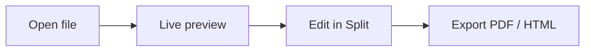

# Welcome to Folio

Folio is a fast, native **Markdown viewer and editor** for macOS, Windows
and Linux. It shows your notes with a clean live preview, turns them into
polished PDF or HTML documents, and keeps your whole folder tree one click
away.

> Everything you see here is rendered live — edit on the left, watch it
> update on the right.

## Highlights

- **Three layouts** — View, Edit and Split, switch anytime with `Ctrl+1/2/3`
- **Live preview** with GitHub-Flavored Markdown
- **Vault sidebar** to browse, pin and search your folders
- **Wikilinks** like [[getting-started]] and [[themes]], with backlinks
- **Command palette** on `Ctrl+P` for files, commands and headings
- **Export** to PDF or HTML with custom themes

## Task list

- [x] Open a Markdown file
- [x] Pin a folder in the Vault
- [ ] Design a custom export theme
- [ ] Translate a document with AI

## A quick table

| Feature | Shortcut | Notes |
|---|---|---|
| Open file | `Ctrl+O` | Or drag a file onto Folio |
| Command palette | `Ctrl+P` | Files, `>` commands, `#` headings |
| Find in file | `Ctrl+F` | `F3` jumps to the next hit |
| Search vault | `Ctrl+Shift+F` | Across all pinned folders |
| Zen mode | `Shift+F11` | Hides every panel |

## Code, too

```rust
fn main() {
    let greeting = "Rendered with syntect highlighting";
    println!("{greeting}");
}
```

## Diagrams with Mermaid



Happy writing! #markdown #welcome
