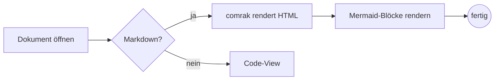
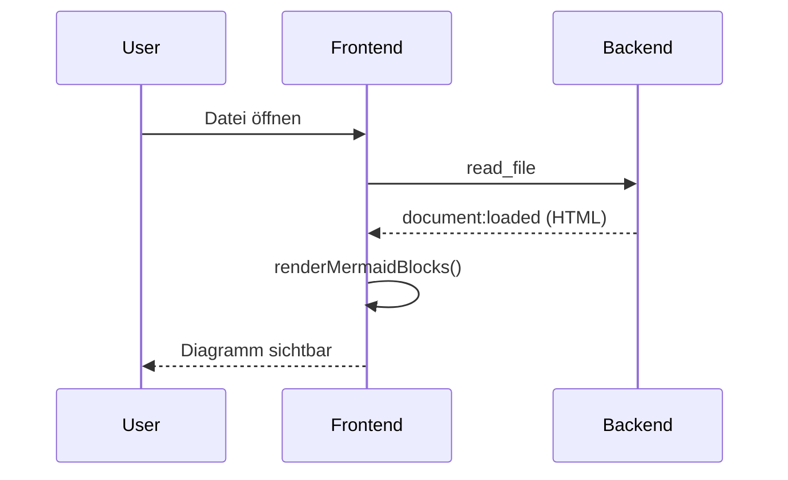
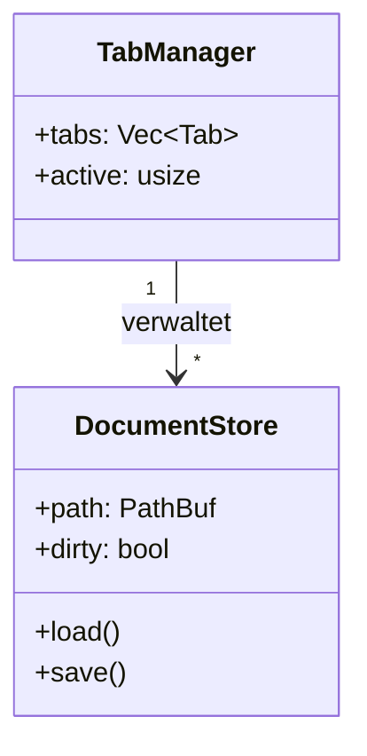
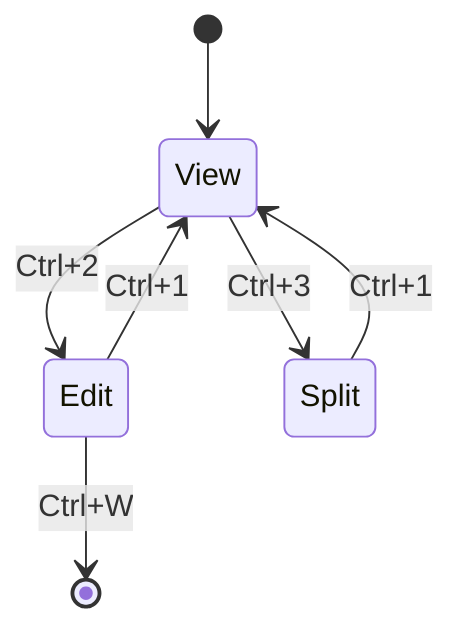
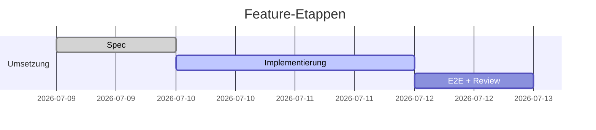
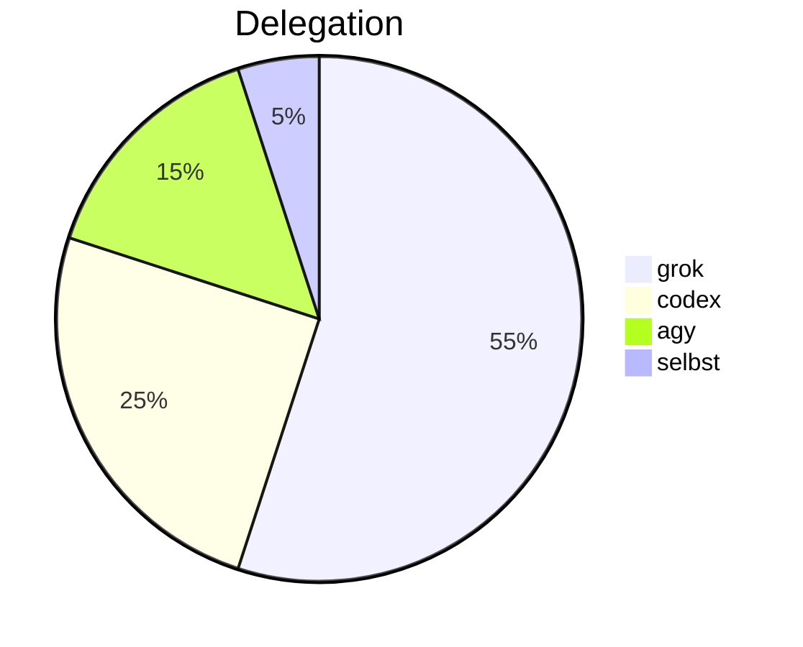

# Mermaid-Diagramme

Testdokument für die Mermaid-Unterstützung. Jeder Block unten ist ein
```` ```mermaid ````-Fence und soll als Diagramm gerendert werden —
nicht als Code-Block.

## Flowchart



## Sequenzdiagramm



## Klassendiagramm



## Zustandsdiagramm



## Gantt



## Kuchendiagramm



## Fehlerfall (absichtlich kaputt)

Der folgende Block enthält ungültige Mermaid-Syntax und soll eine
Fehlermeldung bzw. den Quelltext zeigen — aber nicht die App zerlegen:

```mermaid
flowchart LR
    A --> ???[
```

## Normaler Code-Block (Gegenprobe)

Dieser Block darf **nicht** als Diagramm gerendert werden:

```rust
fn main() {
    println!("kein Diagramm");
}
```
