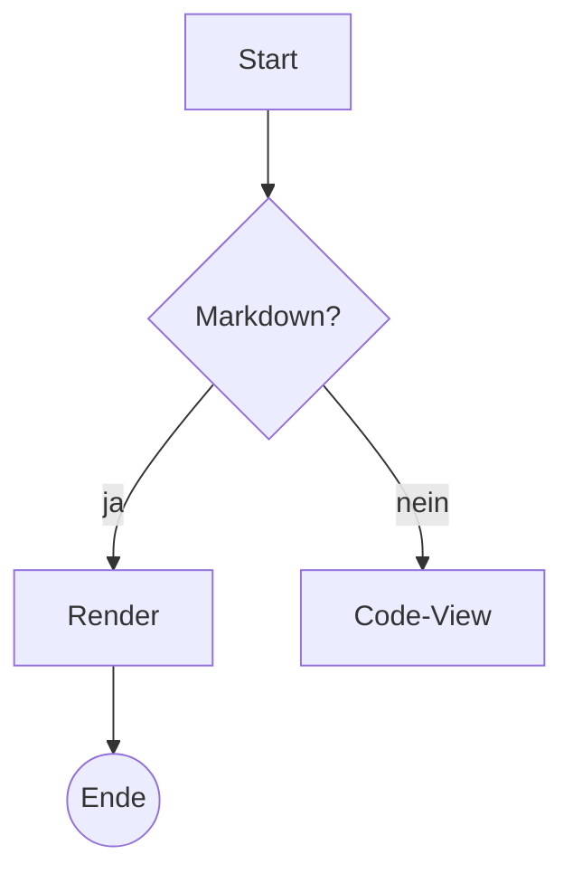

# Mermaid E2E Fixture

Nur fuer Szenario 42 — Flowchart + Gegenprobe Rust.


```mermaid
flowchart TD
    Start[Start] --> Entscheidung{ Markdown? }
    Entscheidung -->|ja| Render[Render]
    Entscheidung -->|nein| Code[Code-View]
    Render --> Ende((Ende))
```

Rust-Block muss als Code-Block bleiben:

```rust
fn main() {
    println!("kein mermaid");
}
```
