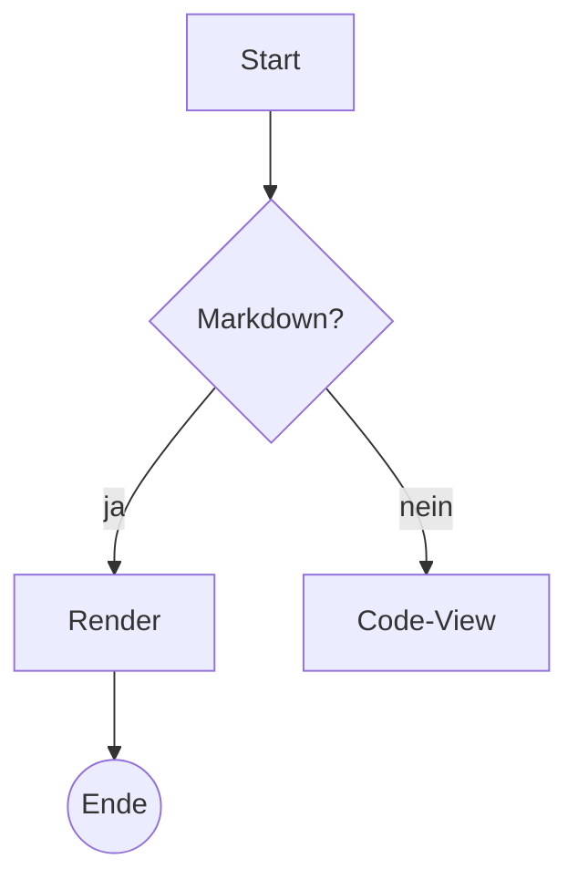

# Mermaid E2E Fixture

Nur fuer Szenario 42 (In-App) und 43 (Export). Flowchart + kaputter Block + Rust-Gegenprobe.



Rust-Block muss als Code-Block bleiben:

```rust
fn main() {
    println!("kein mermaid");
}
```

Kaputter Block (fuer Export-Fallback-Test in 43):

```mermaid
flowchart LR
    A --> ???[
```
